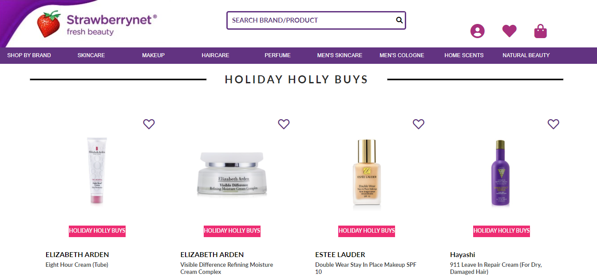

# Strawberry-net
 
Ecommerce website to buy beauty products both for men and women.
 
 

 

# Teach stack

HTML | CSS | JAVASCRIPT | NODEJS | MONGODB | EJS | POSTMAN

# Features
<ul>
    <li>Built Api to fetch data from the backend</li>
    <li>Sort products based on their price or brand</li>
    <li>Search any product by its name</li>
    <li>Built different routes</li>
    <li>Signup/Login feauture with authentication</li>
</ul>
 
<h3 align="left">Connect with me:</h3>

